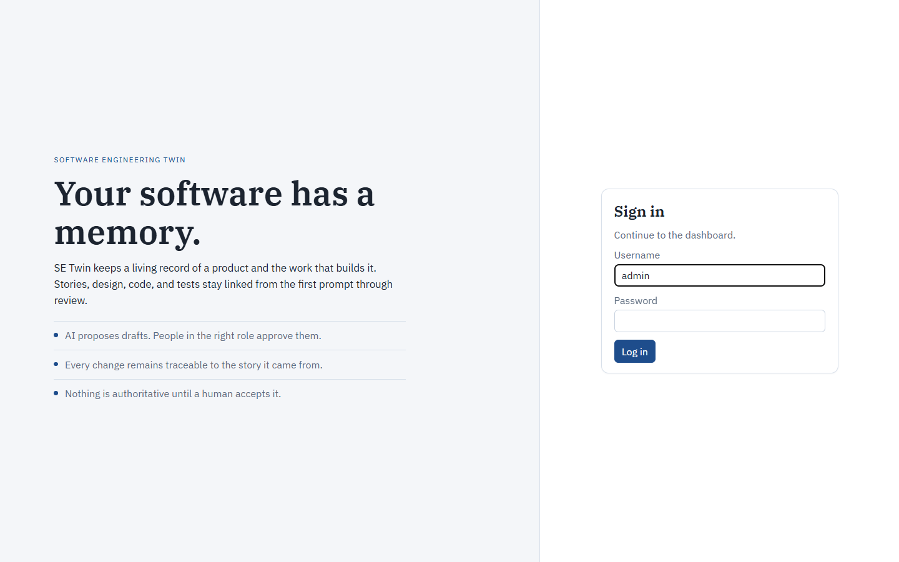
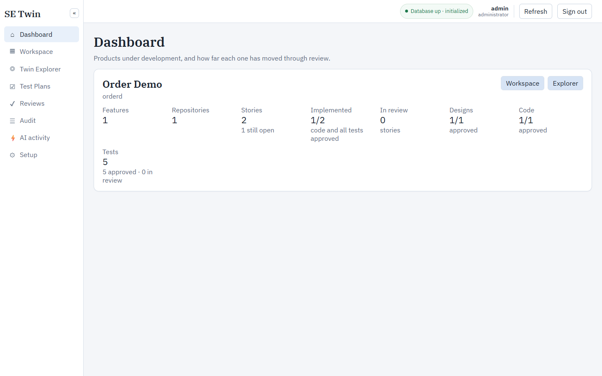
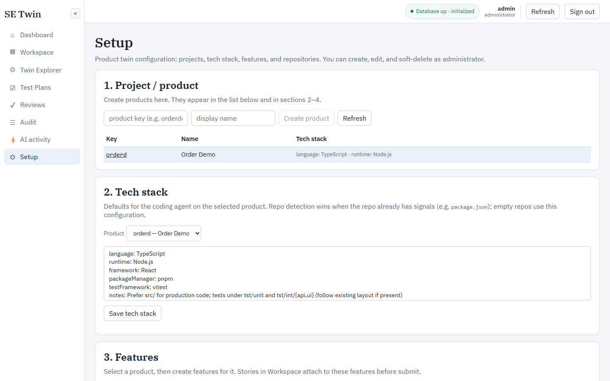
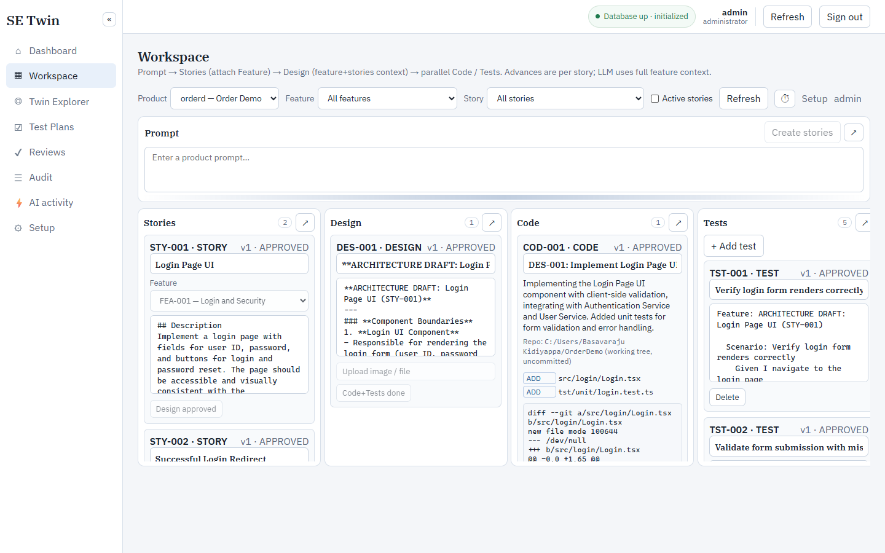
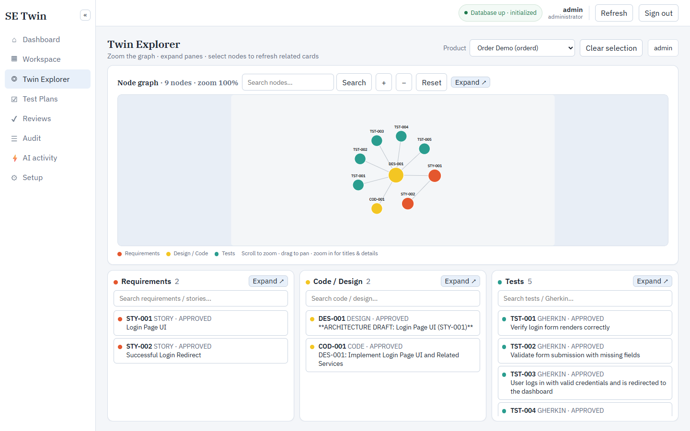
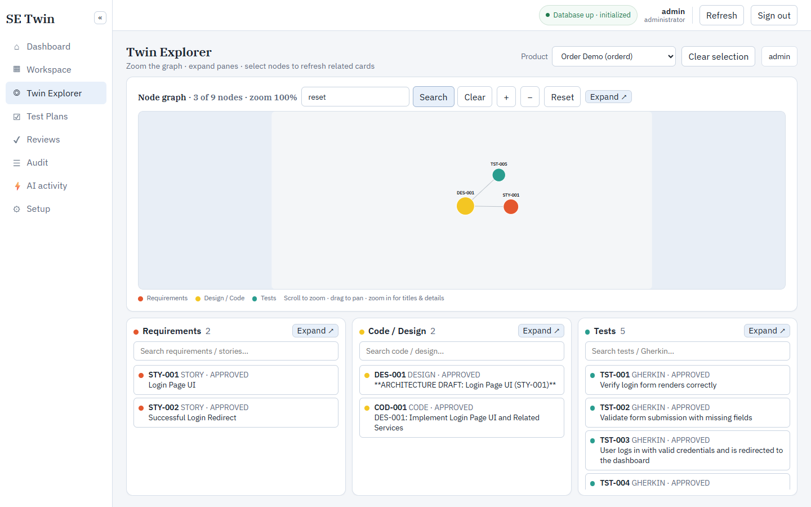
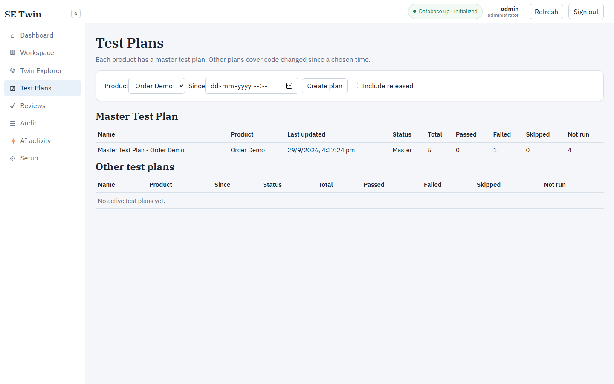
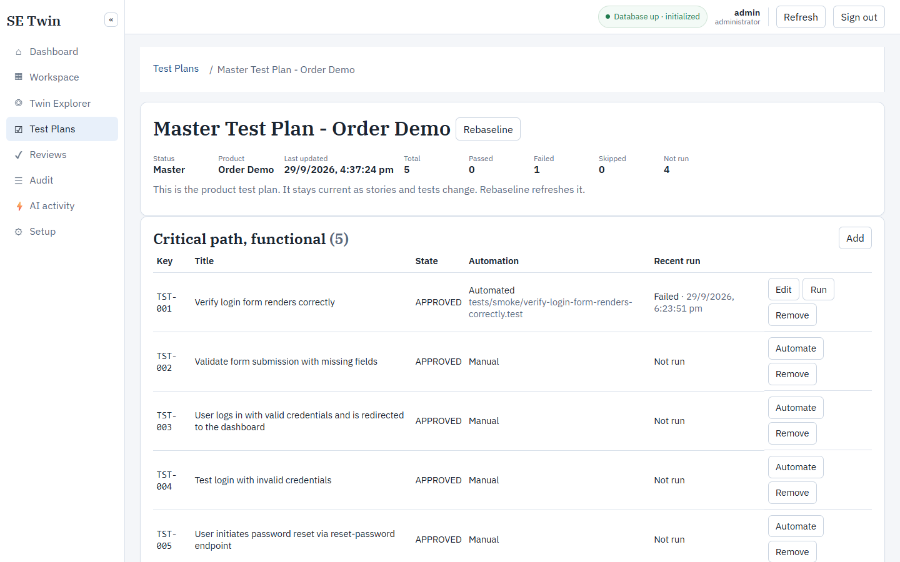

# Using SE Twin

Follow these steps in order the first time. After that, start at [Open the app](#3-open-the-app-and-sign-in) and continue with the product you already created.

SE Twin remembers a product: its stories, design, code, tests, reviews, and test plans. Your git checkout stays the source of the code. SE Twin does not replace Git, and indexing a repo does not delete or commit files.

---

## 1. Install once

You need Node.js 20 or newer, [pnpm](https://pnpm.io/), and a PostgreSQL server that is already running. Docker is optional. `docker compose up -d` in this folder starts a sample server. If you already have Postgres, point `SETWIN_DATABASE_URL` at it and skip Compose. The app does not require the pgvector extension.

From the project folder:

```bash
pnpm install
```

Create `.env`. On Windows:

```bash
copy .env.example .env
```

On macOS or Linux:

```bash
cp .env.example .env
```

Open `.env` and set `SETWIN_DATABASE_URL` to your server. The database named in that URL must already exist. `init` creates tables and roles in it. `init` exits with code 1 when the server cannot be reached.

To use the sample server instead:

```bash
docker compose up -d
docker compose ps
```

Wait until Postgres is healthy, then:

```bash
pnpm setwin -- init
pnpm setwin -- user create admin --password admin-pass
```

The first user is an administrator. Use a password you will remember; `admin-pass` is only an example.

### If init prints Command failed with exit code 1

pnpm wraps every failed script the same way. A failed `init` looks like this, and the last line does not say why:

```text
> setwin@0.1.0 setwin C:\work\SETwin
> tsx apps/cli/src/index.ts init

ELIFECYCLE  Command failed with exit code 1.
```

Read the SETwin text above that line. It prints the URL from `.env` with the password hidden, then a check result. These are the three results and what to do for each.

**Check result: not listening on 127.0.0.1:5432**

Nothing accepted a connection. Common causes:

- `.env` was never created, so init used the default URL. On Linux and macOS the Windows command `copy .env.example .env` fails. Run `cp .env.example .env`, set `SETWIN_DATABASE_URL`, and run init again.
- You already run PostgreSQL somewhere else. Put that host, port, user, password, and database in `SETWIN_DATABASE_URL`. Leave `docker compose` stopped. Docker is optional when this URL reaches your server.
- You wanted the sample server, and `docker compose up -d` had only just returned. That command exits while Postgres is still starting. Run `docker compose ps` and wait until `postgres` is healthy, then run init again. The sample listens on port 5432 with user `setwin`, password `setwin`, and database `setwin`.

**Check result mentions "does not exist"**

Postgres is up. The database name in the URL is missing. `init` creates tables inside that database. Create the database on your server first (`CREATE DATABASE setwin;` when the URL ends in `/setwin`), then run init again. The Compose sample creates `setwin` for you when its volume is new.

**Check result mentions password or authentication**

Postgres is up and the user or password in `SETWIN_DATABASE_URL` does not match that server. The sample server uses `setwin` / `setwin`.

`pnpm setwin -- status` prints the same database check and does not create tables.

If `user create` says authentication is required, an administrator already exists. Sign in with that account. Do not create a second one unless you mean to.

To run the API, web app, and Postgres together on one host, see [Production](production.md).

---

## 2. Start SE Twin

Use two terminals in the project folder. Leave both running.

Terminal 1, the API:

```bash
pnpm dev
```

Wait until the log says `starting api` on `127.0.0.1:8000`.

Terminal 2, the web app:

```bash
pnpm web
```

Open [http://127.0.0.1:5173](http://127.0.0.1:5173).

If port 8000 is already in use, an API is already running. Use that one, or stop it and run `pnpm dev` again. If the browser cannot open port 5173, the web app is not running yet.

---

## 3. Open the app and sign in

1. On the sign-in page, enter the administrator username and password.
2. Click **Log in**.



The top bar shows whether the database is up, who is signed in, **Refresh**, and **Sign out**. **Refresh** reloads the page you are on.



Setup changes are administrator-only. If Setup says read-only, sign in as the administrator.

---

## 4. Set up a product

Open **Setup** in the left menu. Complete the four sections in order.



### 4.1 Create the product

1. Enter a product key: lowercase letters, numbers, and hyphens, such as `orderdemo`.
2. Enter a display name, such as `Order Demo`.
3. Click **Create product**.
4. Click the key in the table so that product is selected for the next sections.

Creating a product also creates its master test plan, named **Master Test Plan - &lt;display name&gt;**. You will see it under **Test Plans**.

### 4.2 Save the tech stack

This is the default language, framework, and test style for generated code. If the git repo already has its own signals (for example `package.json`), those win.

1. Select the product.
2. Edit the tech stack text if you need to.
3. Click **Save tech stack**.

### 4.3 Create at least one feature

Stories in Workspace must be attached to a feature before they can be submitted.

1. Select the product.
2. Enter a feature title and, if you want, a short description.
3. Click **Create feature**.

### 4.4 Register the git checkout and index it

1. Select the product.
2. Paste the absolute path to a local git checkout that this computer can read, for example `C:\work\order-demo`.
3. Click **Register**.
4. Click **Index**.

The page stays usable while indexing. It shows files read, symbols, edges, and the commit. When it finishes, **Last indexed** shows the time and the short commit id.

Index reads the repo. It does not commit, push, or delete that folder. Do not delete the checkout if you still want SE Twin to remember the code.

Optional, for story and code generation: install [Ollama](https://ollama.com/) and set these in `.env`, then restart `pnpm dev`.

```bash
SETWIN_OLLAMA_BASE_URL=http://127.0.0.1:11434
SETWIN_OLLAMA_MODEL=qwen2.5:7b
```

Without a model, you can still create and edit cards by hand. Generation buttons will fail until a model is available.

---

## 5. Use Workspace

Open **Workspace** and choose the product.



1. Write what the product should do in the prompt at the top.
2. Click **Create stories**.
3. On each story, choose a **Feature**, then **Save**.
4. Click **Submit for approval**.
5. Click **Accept** when the story is in review. The person who wrote it should not be the only approver, unless they are the administrator.
6. On an approved story, click **→ Design**.
7. Review the design, submit it, and accept it. You can attach an image or file on the design card.
8. On an approved design, click **→ Code+Tests**.

Code is written into the registered repo as uncommitted files. Review the file list and diff on the code card, then submit and accept the code and the tests.

**Delete** on a story is only there while the story is not implemented and its design is not approved.

**Reject** sends the card back. **Agent revise + resubmit** asks the model for a new draft and submits it again.

---

## 6. Use Twin Explorer

Open **Twin Explorer** and choose the product.



- Click a node to select it. The cards below list the artifacts linked to it.
- When you select a test, those cards show only the nodes directly connected to that test.
- Right-click a node and choose **Tell me about it** to see who created it, which design it is linked to, and who submitted or approved it.
- In the node graph toolbar, type a key or a word and click **Search**. The graph keeps the matching nodes and the links between them, and the count changes to something like `3 of 9 nodes`. **Clear** shows every node again.



---

## 7. Use Test Plans

Open **Test Plans**.



The **Master Test Plan** section is at the top. Each product has one plan named **Master Test Plan - &lt;product name&gt;**. Opening it refreshes the plan from the current stories, code, and tests. **Last updated** is the last time that set changed. **Rebaseline** does the same refresh while you are looking at the plan.



Other plans are saved snapshots:

1. Choose a product and a **Since** date and time.
2. Click **Create plan**.
3. Click the row to open it.

The breadcrumb at the top is **Test Plans / plan name**. Click **Test Plans** to go back to the list.

The summary is across the top: status, product, window, how many code changes are included, and pass, fail, skipped, and not-run totals. **Release** is at the end of that row. Release locks the name, the since time, and which tests are in the plan. Run results still update after release.

While a plan is **Active**, you can change its name and click **Save name**. A released plan cannot be renamed.

Tests are grouped into four lists:

- Critical path, functional
- Critical path, non-functional
- Regression, functional
- Regression, non-functional

A test is non-functional when its Gherkin has `@non-functional`, `@performance`, `@security`, `@accessibility`, or `@reliability`. Each row shows whether it is Automated or Manual, and the latest run: Passed, Failed, Skipped, or Not run.

On the master plan, **Automate** on a manual test writes an OpenSecant script into the registered product repo at `tests/smoke/<name>.test` and links that test to the file. The row then shows **Automated**, the script path, **Edit**, and **Run**.

**Edit** points the test at a different `.test` file already in the repo, or clears the link. The file stays on disk. Use that when several manual tests should share one script: automate the first test, then edit the others onto the same file.

**Run** executes that script. Every test linked to the same file gets the same Passed or Failed result. The product repo needs [OpenSecant](https://github.com/bkidiyappa/OpenSecant) installed so `npx opensecant` runs from that folder. OpenSecant reads `tests/` from the product repo when that folder exists.

Turn on **Include released** to see released plans in the lower list. Master plans stay in the top section.

---

## 8. Reviews, audit, and AI activity

- **Reviews** is the queue of work waiting for a decision.
- **Audit** is the history of who changed what. It is append-only.
- **AI activity** lists model calls. To also write each request and response to `logs/llm.log`, set `SETWIN_LLM_LOG_REQUESTS=true` in `.env` and restart the API. API logs are written to `logs/app.log`.
- **Setup → Agent skills** is where an administrator edits an agent's markdown. **Refresh memory** reloads skills, constraints, and guardrails. Restarting the API loads those same files.

---

## 9. When something goes wrong

| What you see | What to do |
|---|---|
| Browser cannot open port 5173 | In a second terminal, run `pnpm web`. |
| `EADDRINUSE` on port 8000 | An API is already running. Use it, or stop that process and run `pnpm dev` again. |
| `ELIFECYCLE  Command failed with exit code 1` after `pnpm setwin -- init` | pnpm is reporting the exit status. Read the SETwin lines above it, or the section [If init prints Command failed with exit code 1](#if-init-prints-command-failed-with-exit-code-1). |
| Sign-in fails after a reset | Click **Sign out**, then **Log in** again. Old browser tokens do not match a new database. |
| Setup is read-only | Sign in as the administrator. |
| Register rejects the path | Use an absolute path to a git checkout on the same machine as `pnpm dev`. |
| Create stories or Code+Tests fails | Start Ollama, set `SETWIN_OLLAMA_BASE_URL` and `SETWIN_OLLAMA_MODEL`, and restart `pnpm dev`. |
| A page looks like an old version | Restart `pnpm dev`. The API applies database updates when it starts. |

---

## 10. Start over

To erase every product, story, test plan, and repo registration, and also the users, empty the database and run `init` again.

Sample server from Compose:

```bash
docker compose down -v
docker compose up -d
pnpm setwin -- init
pnpm setwin -- user create admin --password admin-pass
```

Your own Postgres: drop and recreate the database named in `SETWIN_DATABASE_URL`, then `pnpm setwin -- init` and `user create` again.

Then sign out in the browser and log in again. This does not delete the git folders you registered. Those stay on disk.

---

## Command line

The same work can be done from the terminal. Put `--` after `setwin` so pnpm passes the flags through.

```bash
pnpm setwin -- login admin --password admin-pass
pnpm setwin -- project create orderdemo --name "Order Demo"
pnpm setwin -- repo register --project orderdemo --path C:\work\order-demo
pnpm setwin -- repo index <repositoryId>
pnpm setwin -- --help
```

Login stores a token in `data/session.json`. Do not commit that file or `.env`. The browser does not keep that token. Sign-in sets an httpOnly cookie, and Sign out revokes it.
